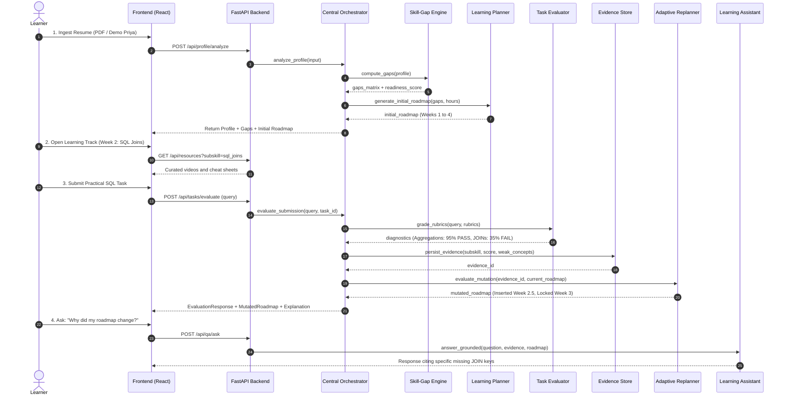
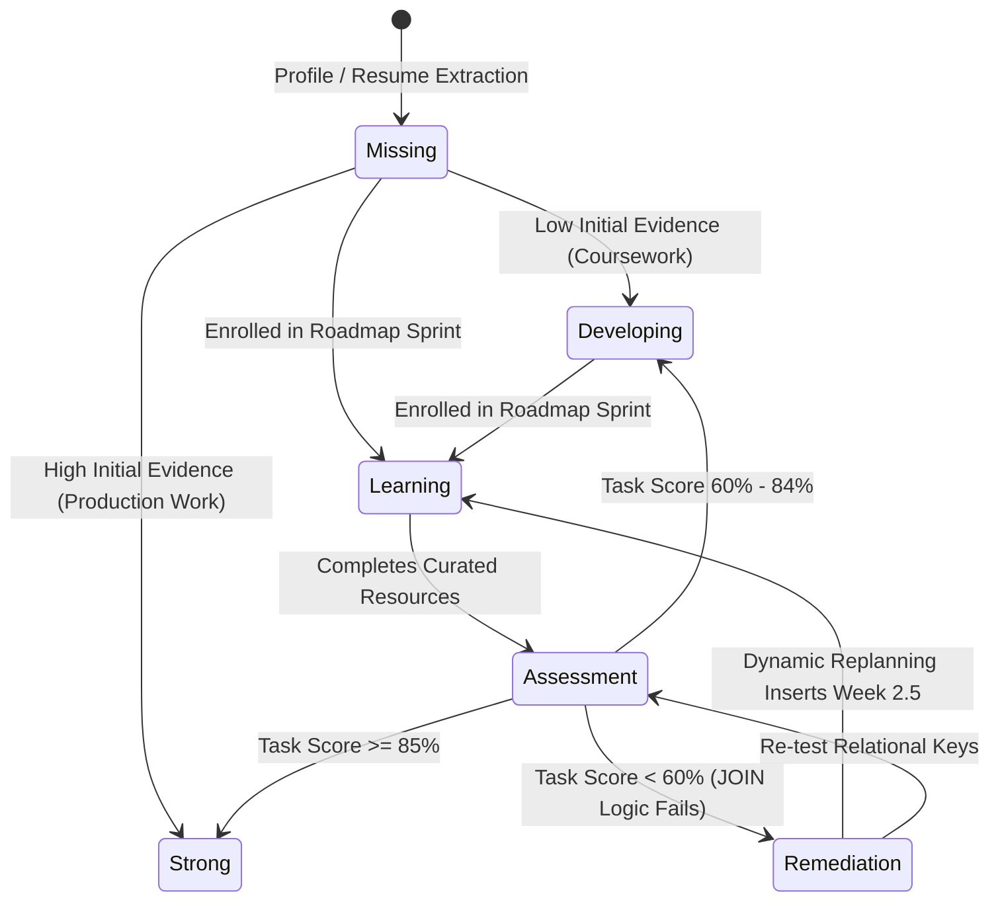

# SkillForge — Complete Technical Blueprint & Implementation Plan

**Target Role:** Data Analyst (Locked for MVP)  
**Deep Adaptive Loop:** SQL (Aggregations vs. Multi-Table JOINs)  
**Architectural Pattern:** Single Orchestrator with Functional Tools/Modules  
**Core Loop:** `Learn → Prove → Diagnose → Adapt`

---

## 1. Project Structure

A clean, decoupled monorepo separating the reactive client application, API backend, orchestrator modules, and deterministic static datasets.

```
c:\AI AGENT (HACKATHON)\
├── PRD.md                                 # Approved Product Requirements Document
├── technical_blueprint.md                 # Technical specification source of truth
├── backend/
│   ├── main.py                            # FastAPI entry point, CORS, and middleware
│   ├── config.py                          # Environment variables and application settings
│   ├── orchestrator.py                    # Central Career & Learning Orchestrator
│   ├── api/
│   │   ├── __init__.py
│   │   ├── routes_profile.py              # Profile, resume parsing, and demo seeding
│   │   ├── routes_gap.py                  # Skill map and gap analysis endpoints
│   │   ├── routes_roadmap.py              # Initial plan, dynamic replanning, mutation logs
│   │   ├── routes_resources.py            # Curated learning track retrieval
│   │   ├── routes_tasks.py                # SQL task generation and submission
│   │   ├── routes_evaluation.py           # Rubric evaluation and subskill diagnosis
│   │   ├── routes_evidence.py             # Skill Evidence Store inspection
│   │   └── routes_qa.py                   # Grounded explainability and learner assistant
│   ├── modules/
│   │   ├── __init__.py
│   │   ├── profile_analyzer.py            # PDF / text extractor & entity confidence scorer
│   │   ├── skill_gap_engine.py            # Ontology matcher & status classifier
│   │   ├── learning_planner.py            # Prerequisite-aware weekly sequencer
│   │   ├── resource_selector.py           # Pre-validated resource ranker and filter
│   │   ├── task_generator.py              # SQL challenge prompt and schema provider
│   │   ├── skill_evaluator.py             # Rule-based and LLM diagnostic evaluator
│   │   ├── evidence_store.py              # Persistent JSON/SQLite evidence ledger
│   │   ├── adaptive_replanner.py          # State mutation and roadmap diff engine
│   │   └── learning_assistant.py          # RAG/context-grounded Q&A engine
│   ├── data/
│   │   ├── ontology_data_analyst.json     # Role taxonomy, subskills, and prerequisites
│   │   ├── curated_resources.json         # Verified YouTube videos and reference guides
│   │   ├── sql_challenges.json            # Table schemas, challenge prompts, rubrics
│   │   ├── sample_resumes.json            # Demo persona profiles (Priya Sharma)
│   │   └── evidence_store.json            # Persistent storage for evidence ledger
│   ├── models/
│   │   ├── __init__.py
│   │   ├── schemas.py                     # Pydantic validation schemas for API & storage
│   │   └── domain.py                      # Enums and core domain abstractions
│   ├── prompts/
│   │   ├── resume_extraction.py           # Structured entity extraction prompt
│   │   ├── subskill_evaluation.py         # Subskill grading rubrics & error classifier
│   │   ├── replanning_explanation.py      # Explainability reasoning prompt
│   │   └── assistant_qa.py                # Grounded chat system prompt
│   └── tests/
│       ├── test_gap_engine.py             # Unit tests for gap classification
│       ├── test_evaluator.py              # Unit tests for SQL JOIN diagnosis
│       ├── test_replanner.py              # Unit tests for roadmap mutation
│       └── test_e2e_loop.py               # Full integration test of adaptive loop
├── frontend/
│   ├── index.html                         # SPA root HTML
│   ├── package.json                       # Dependencies & scripts
│   ├── vite.config.ts                     # Vite build & proxy settings
│   ├── tsconfig.json                      # TypeScript configuration
│   └── src/
│       ├── main.tsx                       # React application entry
│       ├── App.tsx                        # Master container, state provider, screen router
│       ├── index.css                      # Modern dark theme, glassmorphism, animations
│       ├── types/
│       │   └── index.ts                   # TypeScript interfaces matching backend models
│       ├── services/
│       │   └── api.ts                     # Typed Fetch API client for all backend routes
│       ├── hooks/
│       │   ├── useSkillForge.ts           # Central state hook (profile, roadmap, mutation)
│       │   └── useChat.ts                 # Assistant drawer messaging hook
│       ├── components/
│       │   ├── common/
│       │   │   ├── Navbar.tsx             # Top bar with Demo Mode 1-click trigger
│       │   │   ├── Badge.tsx              # Status pill (Strong, Dev, Weak, Missing)
│       │   │   ├── DiffCard.tsx           # Before vs. After comparison card
│       │   │   └── Modal.tsx              # Accessible dialog overlay
│       │   ├── onboarding/
│       │   │   ├── RoleSelector.tsx       # Locked role view with hours commitment slider
│       │   │   └── ResumeUploader.tsx     # Drag-and-drop PDF parser with editable pills
│       │   ├── dashboard/
│       │   │   ├── SkillMatrix.tsx        # Visual skill map grouped by domain
│       │   │   └── GapSummaryCard.tsx     # Overall readiness score and metric gauges
│       │   ├── roadmap/
│       │   │   ├── RoadmapTimeline.tsx    # Weekly sprint container with status indicators
│       │   │   ├── WeekCard.tsx           # Sprint card with task & resource chips
│       │   │   └── MutationBanner.tsx     # High-visibility alert explaining roadmap changes
│       │   ├── learn/
│       │   │   ├── ResourceList.tsx       # Embedded video & reading cards
│       │   │   └── VideoEmbedModal.tsx    # Clean modal video player for YouTube links
│       │   ├── proof/
│       │   │   ├── SqlWorkspace.tsx       # Schema inspector, query editor, prefill buttons
│       │   │   └── SchemaViewer.tsx       # Interactive tables and column definition viewer
│       │   ├── diagnosis/
│       │   │   └── DiagnosticModal.tsx    # Granular subskill pass/fail scorecards
│       │   ├── progress/
│       │   │   └── ProgressLedger.tsx     # Acquired, improving, and remaining skills
│       │   └── assistant/
│       │       └── AskSkillForgeDrawer.tsx# Context-aware chat drawer with suggested queries
```

### Folder Responsibilities

| Directory | Responsibility |
|---|---|
| `backend/api/` | Thin routing controllers validating request payloads, invoking the orchestrator, and returning HTTP responses. |
| `backend/modules/` | Pure business logic functions (stateless where possible) performing extraction, scoring, evaluation, and mutation. |
| `backend/data/` | Ground-truth JSON files for the Data Analyst ontology, curated learning assets, SQL tasks, and sample personas. |
| `backend/models/` | Strictly typed Pydantic models preventing invalid state across the pipeline. |
| `backend/prompts/` | Versioned system and user prompt templates enforcing strict JSON output structures. |
| `frontend/services/` | Centralized network client abstracting all REST API communication. |
| `frontend/hooks/` | React custom hooks managing app-wide state transitions, mutation diffs, and chat logs. |
| `frontend/components/` | Modular, reusable UI components styled with native CSS design tokens. |

---

## 2. System Architecture

SkillForge uses a **Hub-and-Spoke Orchestrator Architecture**. Rather than having unconstrained autonomous agents chatting asynchronously with each other, the **Career & Learning Orchestrator** controls the pipeline flow predictably.



### Data Contracts Between Components

1. **Frontend → API:** `ResumePayload` (FormData or Raw Text)
2. **API → Orchestrator:** `UserProfile` object
3. **Orchestrator → Skill-Gap Engine:** `UserProfile` + `RoleOntology`
4. **Skill-Gap Engine → Learning Planner:** `List[SkillGapItem]` sorted by priority
5. **Learning Planner → Frontend:** `RoadmapState` (Ordered weekly objectives with tasks and resource references)
6. **Frontend → Evaluator:** `SqlSubmission` (`task_id`, `user_id`, `query_text`)
7. **Evaluator → Evidence Store:** `EvidenceRecord` (Structured diagnostics, subskill scores, error patterns)
8. **Evidence Store → Replanner:** Latest `EvidenceRecord` + current active `RoadmapState`
9. **Replanner → Frontend:** `RoadmapMutationLog` (`old_step`, `new_step`, `explanation`, `mutated_weeks`)

---

## 3. Agent & Module Structure

| Module | Responsibility | Trigger | Input | Output |
|---|---|---|---|---|
| **Profile Analyzer** | Parses resume text or PDF into structured skills, tools, and experience. Assigns confidence scores. | User uploads resume or clicks demo profile. | Raw text / PDF file bytes. | `UserProfile` with `List[ExtractedSkill]`. |
| **Skill-Gap Engine** | Benchmarks learner skills against the Data Analyst ontology. Computes readiness & gap matrix. | Profile creation or manual skill edits. | `UserProfile` + `ontology_data_analyst.json`. | `SkillGapResponse` (`Strong`, `Developing`, `Weak`, `Missing`). |
| **Learning Planner** | Sequences learning objectives into weekly sprints respecting prerequisites and hour budgets. | Gap analysis completion or replanning trigger. | `List[SkillGapItem]` + weekly hours. | `RoadmapState` (Weeks 1 to 4). |
| **Resource Selector** | Filters and ranks verified YouTube videos and documentation matching active subskills. | Learner views a roadmap week or remediation module. | `subskill_id` + `difficulty_level`. | `List[ResourceItem]` with duration and rationale. |
| **Practice / Task Generator** | Serves the structured SQL challenge prompt, schema definitions, and starter code. | Learner clicks "Prove Skill" on a roadmap sprint. | `task_id` (`challenge_sql_join_01`). | `TaskDefinition` with tables, schema, and rubric. |
| **Skill Evaluator** | Executes rubric-based syntax and semantic inspection against the submitted query. | Learner clicks "Submit for Diagnosis". | `query_text` + `rubrics`. | `List[SubskillDiagnostic]` (Pass/Fail, score, errors). |
| **Skill Diagnosis** | Synthesizes evaluator output into human-readable conceptual feedback. | Post-evaluation. | Subskill diagnostic scores. | `overall_score`, `summary_feedback`, `requires_replanning`. |
| **Skill Evidence Store** | Manages persistent ledger of practical evidence, error patterns, and recommended next actions. | Following every completed evaluation. | Diagnostic result payload. | `EvidenceRecord` with persistent `id` and timestamp. |
| **Adaptive Replanner** | Evaluates if evidence violates progression thresholds. Mutates roadmap and produces visual diff. | New evidence stored with score < 60% on core subskill. | `EvidenceRecord` + current `RoadmapState`. | `MutatedRoadmap` + `RoadmapMutationLog`. |
| **Progress Tracker** | Calculates competency velocity and maps acquired, improving, and remaining skills. | Dashboard load or post-replanning. | `List[EvidenceRecord]` + `SkillGapResponse`. | `ProgressSummary` for dashboard display. |
| **Learning Assistant** | Answers learner queries strictly grounded in their profile, latest query failure, and roadmap diff. | Learner submits message in chat drawer. | `question` + learner context + evidence ledger. | `QAResponse` with evidence citations. |

---

## 4. Database & State Structure

The hackathon MVP utilizes a local persistent JSON/SQLite document store structured across 14 normalized entities.

### Entity Schemas

#### 1. `User`
- `id`: `string` (Required, PK) — Unique learner identifier (e.g., `"priya-101"`).
- `created_at`: `string` (Required) — ISO timestamp.
- `last_active`: `string` (Required) — ISO timestamp.

#### 2. `Profile`
- `user_id`: `string` (Required, FK -> `User.id`) — Associated user.
- `name`: `string` (Required) — Learner display name.
- `target_role`: `string` (Required) — Locked to `"Data Analyst"`.
- `career_goal`: `string` (Required) — Target timeframe and goal.
- `hours_per_week`: `integer` (Required) — Weekly commitment (e.g., `10`).
- `education`: `string` (Optional) — Extracted education background.

#### 3. `ResumeDocument`
- `id`: `string` (Required, PK) — Document ID.
- `user_id`: `string` (Required, FK -> `User.id`).
- `filename`: `string` (Required) — Name of uploaded file.
- `raw_text`: `string` (Required) — Full extracted plaintext.
- `parsed_at`: `string` (Required) — ISO timestamp.

#### 4. `Role`
- `id`: `string` (Required, PK) — `"data_analyst"`.
- `title`: `string` (Required) — `"Data Analyst"`.
- `description`: `string` (Required) — Role summary.

#### 5. `Skill` (Domain Level)
- `id`: `string` (Required, PK) — E.g., `"sql"`, `"excel"`, `"python"`, `"bi_tools"`, `"statistics"`.
- `role_id`: `string` (Required, FK -> `Role.id`).
- `name`: `string` (Required) — E.g., `"SQL & Relational Databases"`.
- `weight`: `float` (Required) — Relative importance in role (e.g., `0.35`).

#### 6. `Subskill`
- `id`: `string` (Required, PK) — E.g., `"sql_basics"`, `"sql_aggregations"`, `"sql_joins"`, `"sql_window_functions"`.
- `skill_id`: `string` (Required, FK -> `Skill.id`).
- `name`: `string` (Required) — E.g., `"Relational Multi-Table JOINs"`.
- `prerequisites`: `string[]` (Required) — List of `Subskill.id` prerequisites.
- `difficulty_tier`: `string` (Required) — `"Foundational" | "Core" | "Advanced"`.

#### 7. `SkillGap`
- `id`: `string` (Required, PK).
- `user_id`: `string` (Required, FK -> `User.id`).
- `subskill_id`: `string` (Required, FK -> `Subskill.id`).
- `status`: `string` (Required) — `"Strong" | "Developing" | "Weak" | "Missing"`.
- `confidence`: `float` (Required) — Confidence in categorization (`0.0` - `1.0`).
- `priority`: `integer` (Required) — Schedulability weight (`1` = Highest to `5` = Lowest).
- `evidence_text`: `string` (Required) — Rationale for classification.

#### 8. `SkillEvidence` (The Core Ledger)
- `id`: `string` (Required, PK) — Unique evidence record ID (`"evid-xxxx"`).
- `user_id`: `string` (Required, FK -> `User.id`).
- `subskill`: `string` (Required, FK -> `Subskill.id`) — E.g., `"sql_joins"`.
- `source`: `string` (Required) — `"resume" | "assessment"`.
- `evidence_text`: `string` (Required) — Exact snippet or summary of submitted query.
- `score`: `integer` (Required) — Numeric score (`0` to `100`).
- `confidence`: `float` (Required) — Evaluator confidence.
- `weak_concepts`: `string[]` (Required) — Conceptual tags (e.g., `["cartesian_product", "missing_on_clause"]`).
- `next_action`: `string` (Required) — E.g., `"remediate_joins_before_window_functions"`.
- `timestamp`: `string` (Required) — ISO timestamp.

#### 9. `LearningObjective`
- `id`: `string` (Required, PK).
- `subskill_id`: `string` (Required, FK -> `Subskill.id`).
- `title`: `string` (Required) — Description of the weekly goal.
- `estimated_hours`: `integer` (Required) — Time budget.

#### 10. `Resource`
- `id`: `string` (Required, PK) — E.g., `"res_sql_04"`.
- `subskill_id`: `string` (Required, FK -> `Subskill.id`).
- `title`: `string` (Required) — Resource title.
- `author`: `string` (Required) — E.g., `"Luke Barousse"`.
- `url`: `string` (Required) — Verified YouTube or documentation URL.
- `type`: `string` (Required) — `"video" | "documentation" | "guide"`.
- `duration_minutes`: `integer` (Required) — E.g., `22`.
- `reason_selected`: `string` (Required) — Rationale for recommendation.

#### 11. `Task`
- `id`: `string` (Required, PK) — E.g., `"challenge_sql_join_01"`.
- `target_subskill`: `string` (Required, FK -> `Subskill.id`).
- `title`: `string` (Required) — Challenge headline.
- `prompt`: `string` (Required) — Problem statement.
- `schemas`: `object` (Required) — Table definitions, columns, and sample rows.
- `starter_code`: `string` (Required) — Pre-filled editor template.

#### 12. `Assessment`
- `id`: `string` (Required, PK).
- `task_id`: `string` (Required, FK -> `Task.id`).
- `user_id`: `string` (Required, FK -> `User.id`).
- `submitted_work`: `string` (Required) — Learner's SQL query.
- `overall_score`: `integer` (Required) — Aggregated score (`0` to `100`).
- `passed`: `boolean` (Required) — Mastery status.
- `diagnostics`: `object[]` (Required) — Subskill-level rubric outcomes.
- `timestamp`: `string` (Required) — ISO timestamp.

#### 13. `Roadmap`
- `id`: `string` (Required, PK).
- `user_id`: `string` (Required, FK -> `User.id`).
- `has_mutation`: `boolean` (Required) — Mutation flag.
- `mutation_explanation`: `string` (Optional) — Reason for state diff.
- `weeks`: `object[]` (Required) — Ordered list of weekly sprint objects.

#### 14. `RoadmapChange`
- `id`: `string` (Required, PK).
- `user_id`: `string` (Required, FK -> `User.id`).
- `trigger_evidence_id`: `string` (Required, FK -> `SkillEvidence.id`).
- `trigger_subskill`: `string` (Required) — `"sql_joins"`.
- `old_step`: `string` (Required) — E.g., `"Week 3: Advanced SQL & Window Functions"`.
- `new_step`: `string` (Required) — E.g., `"Week 2.5: Multi-Table JOIN Remediation & Drills"`.
- `explanation`: `string` (Required) — Justification for the change.
- `timestamp`: `string` (Required) — ISO timestamp.

---

## 5. End-to-End Data Flow

### Flow A: Ingestion to Initial Roadmap
```
1. Resume Upload / Demo Seed
   │
   ▼
2. Profile Analyzer: Parses PDF/Text ➔ Extracts ExtractedSkills (with confidence)
   │
   ▼
3. Evidence Store: Initializes baseline evidence (Excel=Strong, Python=Dev, SQL=Novice)
   │
   ▼
4. Skill-Gap Engine: Compares against Data Analyst ontology
   │   • Excel: Strong
   │   • Python: Developing
   │   • SQL: Weak / Missing
   │   • Power BI: Missing
   │   • Readiness Score: 42%
   │
   ▼
5. Learning Planner: Generates 4-Week Linear Sprint
       Week 1: SQL Foundations (Basics + Aggregations)
       Week 2: Relational Queries & Multi-Table JOINs
       Week 3: Advanced SQL (Window Functions & CTEs)
       Week 4: Business Intelligence & Power BI
   │
   ▼
6. Frontend: Displays Skill Matrix + Initial Roadmap
```

### Flow B: Task Submission to Adaptive Replanning
```
1. Learner submits SQL query in Skill Proof Workspace:
   SELECT c.tier, SUM(oi.quantity * oi.unit_price) AS total_revenue
   FROM customers c, orders o, order_items oi
   GROUP BY c.tier;
   │
   ▼
2. Skill Evaluator executes diagnostic rubrics:
   • Aggregations & GROUP BY: ✅ 95% (Correct SUM, correct GROUP BY)
   • Multi-Table JOIN Logic: ❌ 35% (Cartesian product, missing ON keys)
   │
   ▼
3. Skill Evidence Store records new entry:
   {
     "subskill": "sql_joins",
     "score": 35,
     "confidence": 0.95,
     "weak_concepts": ["cartesian_product", "missing_relational_keys"],
     "next_action": "insert_remediation_drill"
   }
   │
   ▼
4. Adaptive Replanner triggers:
   • Detects sql_joins score < 60% on critical prerequisite
   • Inserts Week 2.5: "Multi-Table JOIN Remediation & Drills"
   • Locks Week 3 ("Advanced SQL") until Week 2.5 is mastered
   • Generates RoadmapMutationLog with exact reasoning
   │
   ▼
5. Frontend renders:
   • Diagnostic Scorecard Modal (showing subskill Pass/Fail)
   • Dynamic Mutation Banner with diff view
   • Updated Roadmap reflecting inserted Week 2.5
```

---

## 6. Frontend Structure: 10 MVP Screens

| Screen # | Screen Name | Purpose | Key Components | Data Consumed | Actions & API Calls | Post-Action Result |
|---|---|---|---|---|---|---|
| **1** | **Onboarding** | Profile setup & commitment budget. | `RoleSelector`, `HoursSlider`, `GoalInput` | Default Data Analyst role profile. | Click *"Next"* or *"Load Priya Demo"*. | Advances to Resume Ingestion screen. |
| **2** | **Resume Analyzer** | Ingest resume and review extracted entities. | `ResumeUploader`, `ExtractedBadges`, `QuickDemoButton` | Uploaded PDF or pre-parsed sample. | `POST /api/profile/analyze` | Populates profile; triggers gap analysis. |
| **3** | **Skill Gap Dashboard** | Visual gap matrix and readiness overview. | `SkillMatrix`, `GapSummaryCard`, `ReadinessGauge` | `SkillGapResponse` (Strong/Dev/Weak/Missing). | Filter by domain; click *"View Roadmap"*. | Navigates to My Roadmap screen. |
| **4** | **My Roadmap** | Interactive timeline of weekly sprints. | `RoadmapTimeline`, `WeekCard`, `MutationAlert` | `RoadmapState` (Weeks 1 to 4). | Click *"Open Learning Track"* on active week. | Opens Week 2 Learning Track. |
| **5** | **Learning Track** | High-signal curated tutorials & videos. | `ResourceList`, `ResourceCard`, `VideoModal` | `curated_resources.json` for `sql_joins`. | Click video card (opens modal); click *"Start Skill Proof"*. | Navigates to Skill Proof challenge. |
| **6** | **Skill Proof** | Practical SQL execution challenge. | `SqlWorkspace`, `SchemaViewer`, `PrefillButtons` | `sql_challenges.json` prompt & schema. | Click *"Simulate Weak JOINs"* ➔ Click *"Submit"*. Calls `POST /api/tasks/evaluate`. | Opens Diagnostic Result modal. |
| **7** | **Diagnostic Result** | Granular subskill pass/fail scorecard. | `DiagnosticModal`, `RubricBar`, `WeakConceptTags` | `EvaluationResponse` (Aggregations vs. JOINs). | Inspect failure points; click *"Update Roadmap"*. | Triggers replanning; navigates to Roadmap Mutation screen. |
| **8** | **Roadmap Mutation** | Before vs. After diff demonstrating adaptation. | `DiffCard`, `MutationBanner`, `LockIndicator` | `RoadmapMutationLog` + updated `RoadmapState`. | Inspect diff; click *"View Remediated Track"*. | Shows inserted Week 2.5 and locked Week 3. |
| **9** | **Progress Report** | Cumulative mastery velocity and ledger. | `ProgressLedger`, `EvidenceHistory`, `MasteryPills` | `List[EvidenceRecord]`. | Review historical evidence entries. | Confirms state persistence. |
| **10** | **Ask SkillForge** | Grounded conversational explainability. | `AskSkillForgeDrawer`, `PromptSuggestions`, `ChatStream` | Evidence ledger + active roadmap state. | Click *"Why did my plan change?"*. Calls `POST /api/qa/ask`. | Displays citation grounded in submitted query failure. |

---

## 7. Complete API Specification

### 1. `POST /api/profile/demo`
- **Purpose:** Seeds the Priya Sharma demo profile into memory and storage.
- **Request:** Empty body.
- **Response:** `200 OK` → `UserProfile`
- **Errors:** `500 Internal Server Error`

### 2. `POST /api/profile/analyze`
- **Purpose:** Ingests PDF resume file or raw text and extracts structured skills.
- **Request:** `multipart/form-data` with `file: UploadFile` OR JSON `{"raw_text": "string", "name": "string"}`.
- **Response:** `200 OK` → `UserProfile`
- **Errors:** `400 Bad Request` (invalid format), `422 Unprocessable Entity`.

### 3. `GET /api/gaps`
- **Purpose:** Retrieves the computed skill gap matrix and readiness percentage for the active profile.
- **Request:** Query param `?user_id=priya-101`.
- **Response:** `200 OK` → `SkillGapResponse`
- **Errors:** `404 Not Found` (user profile missing).

### 4. `GET /api/roadmap`
- **Purpose:** Fetches current roadmap state, including any active mutations.
- **Request:** Query param `?user_id=priya-101`.
- **Response:** `200 OK` → `RoadmapState`
- **Errors:** `404 Not Found`.

### 5. `GET /api/resources`
- **Purpose:** Retrieves curated learning resources for a specific subskill.
- **Request:** Query param `?subskill=sql_joins`.
- **Response:** `200 OK` → `List[ResourceItem]`
- **Errors:** `400 Bad Request` (missing subskill param).

### 6. `GET /api/tasks/sql`
- **Purpose:** Retrieves the interactive SQL challenge definition, schemas, and starter query.
- **Request:** Query param `?challenge_id=challenge_sql_join_01`.
- **Response:** `200 OK` → `TaskDefinition`
- **Errors:** `404 Not Found`.

### 7. `POST /api/tasks/evaluate`
- **Purpose:** Evaluates submitted SQL, updates the Evidence Store, and computes subskill diagnostics.
- **Request:** JSON `{"user_id": "priya-101", "challenge_id": "challenge_sql_join_01", "query_text": "string"}`.
- **Response:** `200 OK` → `EvaluationResponse`
- **Errors:** `400 Bad Request` (empty query).

### 8. `POST /api/roadmap/replan`
- **Purpose:** Triggers dynamic replanning against the latest evidence.
- **Request:** JSON `{"user_id": "priya-101"}`.
- **Response:** `200 OK` → `RoadmapMutationLog` + updated `RoadmapState`
- **Errors:** `400 Bad Request`.

### 9. `GET /api/evidence`
- **Purpose:** Retrieves historical evidence ledger entries for auditability.
- **Request:** Query param `?user_id=priya-101`.
- **Response:** `200 OK` → `List[EvidenceRecord]`
- **Errors:** `404 Not Found`.

### 10. `POST /api/qa/ask`
- **Purpose:** Grounded chat answering explainability queries.
- **Request:** JSON `{"user_id": "priya-101", "question": "Why did my roadmap change?"}`.
- **Response:** `200 OK` → `QAResponse` (`answer`, `citations`, `suggested_actions`)
- **Errors:** `400 Bad Request`.

### 11. `POST /api/demo/reset`
- **Purpose:** Wipes mutated state and resets the demo to the pre-assessment state.
- **Request:** Empty body.
- **Response:** `200 OK` → `{"status": "reset_successful"}`

---

## 8. AI Prompt Structure & JSON Schemas

All prompts strictly enforce structured JSON outputs to ensure deterministic state handling.

### 1. Resume Entity Extraction Prompt
```
SYSTEM:
You are an expert Career Skills Extractor for technical roles.
Extract all technical skills, project experiences, and tools from the provided resume text.
Output MUST be a valid JSON object matching the schema below.

JSON SCHEMA:
{
  "name": "string",
  "education": "string",
  "skills": [
    {
      "name": "string",
      "subskill": "sql_basics | sql_joins | python_pandas | excel_lookups | stats_descriptive",
      "category": "Databases | Spreadsheets | Programming | BI Tools | Analytics",
      "proficiency": "Advanced | Intermediate | Novice | None",
      "confidence": 0.0 - 1.0,
      "evidence": "string quote or citation from text"
    }
  ]
}

USER:
{resume_text}
```

### 2. Subskill Diagnostic Evaluation Prompt
```
SYSTEM:
You are a Lead Database Architect grading an SQL assessment for a Data Analyst learner.
Grade the student query strictly against two rubrics:
1. "Aggregations & Grouping": Did they use SUM(quantity * unit_price) and GROUP BY c.tier correctly?
2. "Multi-Table JOIN Logic": Did they write explicit INNER/LEFT JOIN statements with valid foreign key matches (c.customer_id = o.customer_id AND o.order_id = oi.order_id) without Cartesian products?

Output MUST be a valid JSON object.

JSON SCHEMA:
{
  "overall_score": 0 - 100,
  "passed": boolean,
  "diagnostics": [
    {
      "subskill_id": "sql_aggregations",
      "subskill_name": "Aggregations & Grouping",
      "score": 0 - 100,
      "passed": boolean,
      "weak_concepts": ["string"],
      "feedback": "string"
    },
    {
      "subskill_id": "sql_joins",
      "subskill_name": "Relational Multi-Table JOIN Logic",
      "score": 0 - 100,
      "passed": boolean,
      "weak_concepts": ["string"],
      "feedback": "string"
    }
  ],
  "summary_feedback": "string",
  "requires_replanning": boolean
}

USER:
Task: Calculate total revenue per customer tier.
Tables:
- customers (customer_id, customer_name, tier)
- orders (order_id, customer_id, order_date, status)
- order_items (item_id, order_id, product_name, quantity, unit_price)

Student Submission:
{student_query}
```

### 3. Explainability & Grounded Assistant Prompt
```
SYSTEM:
You are SkillForge's Grounded Learning Assistant.
Answer the student's question strictly using the provided context:
- Learner Profile
- Active Roadmap
- Latest Evidence Record (including their submitted query and diagnostic errors)
- Recent Roadmap Mutation Log

If they ask "Why did my roadmap change?", explain that their submission passed aggregation but failed multi-table JOIN conditions, causing a Cartesian product, which is why a targeted remediation drill was inserted.
Keep explanations encouraging, clear, and direct.

JSON SCHEMA:
{
  "answer": "string",
  "citations": ["string"],
  "suggested_actions": ["string"]
}

CONTEXT:
{learner_context_json}

USER:
{question}
```

---

## 9. Curated Resource System

Stored in `backend/data/curated_resources.json`. AI selects resources using deterministic metadata filters:
- `subskill`: Exact match with the target subskill (e.g., `sql_joins` or `remediation_joins`).
- `difficulty`: Matches learner status (`Novice` for Missing, `Intermediate` for Developing, `Remedial` for post-failure).
- `duration`: Balances within learner's weekly hour allocation (e.g., 10 hrs/week = max 45 mins video per sprint).
- `prerequisites`: Checks if prior concepts are met before serving advanced tracks.

---

## 10. Adaptive Replanning Logic & Concrete Example

### Replanning Rules Engine
```python
IF latest_evidence.subskill == "sql_joins" AND latest_evidence.score < 60:
    # 1. Identify dependent downstream modules
    downstream = ["sql_window_functions", "powerbi_modeling"]
    
    # 2. Mutate roadmap: Insert remediation sprint
    mutated_week = RoadmapWeek(
        week_number=2.5,
        week_label="Week 2.5 (Remediation Drill)",
        title="Targeted Remediation: Multi-Table Relational Keys & Cartesian Prevention",
        focus_subskill="sql_joins_remediation",
        objective="Master explicit JOIN ... ON syntax across 3+ tables before advancing.",
        status="active",
        is_mutation_insert=True,
        resources=load_resources("remediation_joins"),
        task=load_task("challenge_sql_join_remediation_drill")
    )
    
    # 3. Shift and lock advanced modules
    roadmap.weeks.insert(2, mutated_week)
    for week in roadmap.weeks:
        if week.focus_subskill in downstream:
            week.status = "locked"
            week.objective += " [LOCKED: Requires clearing Week 2.5 Remediation]"
            
    # 4. Generate mutation audit log
    log_mutation(
        trigger_subskill="sql_joins",
        old_step="Advance directly from Week 2 JOINs to Week 3 Advanced SQL",
        new_step="Inserted Week 2.5 Relational Drill; Locked Week 3 Advanced SQL",
        explanation="Assessment showed strong aggregation logic (95%) but critical deficiency in multi-table JOIN conditions (35%). Remediating relational keys is required before Window Functions can be unlocked."
    )
```

### Concrete State Mutation Diff

| Element | Initial State (Before Task) | Adapted State (Post-Evaluation) |
|---|---|---|
| **Week 1** | SQL Foundations (`sql_basics` + `sql_aggregations`) — *Completed* | SQL Foundations — *Completed* |
| **Week 2** | Relational Multi-Table JOINs (`sql_joins`) — *Active* | Relational Multi-Table JOINs — *Remediated* |
| **Week 2.5** | *Does not exist* | **Inserted:** Multi-Table Relational Drill — **Active** |
| **Week 3** | Advanced SQL & Window Functions — *Active* | Advanced SQL & Window Functions — **Locked** |
| **Week 4** | Business Intelligence & Power BI — *Locked* | Business Intelligence & Power BI — *Locked* |

---

## 11. Learner & Roadmap State Machine



### State Transition Triggers

| Current State | Event | Target State | Triggering Condition |
|---|---|---|---|
| `Missing` | Resume Analysis | `Developing` | Resume shows academic exposure without production projects. |
| `Missing` | Start Sprint | `Learning` | User accesses Week 1 learning resources. |
| `Learning` | Complete Study | `Assessment` | User clicks *"Start Skill Proof Challenge"*. |
| `Assessment` | Submit Query | `Remediation` | Diagnostic score on core subskill < 60%. |
| `Remediation` | Replanner Runs | `Learning` | Roadmap mutates, injecting Week 2.5 remediation module. |
| `Remediation` | Re-test Query | `Strong` | User re-submits query with valid `JOIN ... ON` keys (score >= 85%). |

---

## 12. Minimal Project Dependencies

### Backend Dependencies (`requirements.txt`)
- `fastapi==0.141.1` — REST API framework
- `uvicorn==0.40.0` — ASGI web server
- `pydantic==2.13.5` — Data validation and schema enforcement
- `python-multipart==0.0.32` — Multipart form handling for PDF uploads
- `pypdf==6.19.0` — PDF text extraction

### Frontend Dependencies (`package.json`)
- `react@^18.3.1` — View layer
- `react-dom@^18.3.1` — DOM renderer
- `lucide-react@^0.344.0` — Clean developer icons
- `typescript@^5.2.2` — Type safety
- `vite@^5.1.4` — Fast development & build tooling

*No heavy external database or complex agent frameworks required. Pure standard library persistence and predictable state machines.*

---

## 13. Comprehensive Testing Plan

### Automated Tests
1. **`test_gap_engine.py`**:
   - Verify Priya's profile calculates Excel as `Strong`, Python as `Developing`, and SQL as `Weak/Missing`.
   - Verify overall readiness score calculates to ~42%.
2. **`test_evaluator.py`**:
   - Test canonical buggy query: asserts `Aggregations` score >= 90 and `JOINs` score <= 40.
   - Test canonical correct query: asserts both scores >= 90.
3. **`test_replanner.py`**:
   - Assert that an evaluation with JOIN score < 60% inserts Week 2.5 into the roadmap.
   - Assert that Week 3 status is switched to `locked`.
4. **`test_e2e_loop.py`**:
   - Ingest profile ➔ generate roadmap ➔ submit flawed query ➔ verify roadmap mutation ➔ query grounded assistant.

---

## 14. Phased Hackathon Build Plan (12 Phases)

```
Phase 1: Project Foundation & Data Analyst Ontology (Data models, schemas, JSON datasets)
   ↓
Phase 2: Profile & Resume Parser (PDF upload, text parsing, Priya demo seed)
   ↓
Phase 3: Skill Gap Engine (Status classification, readiness score)
   ↓
Phase 4: Initial Personalized Roadmap Generator (4-week sequenced plan)
   ↓
Phase 5: Curated Learning Resources Engine (Verified YouTube videos & cheat sheets)
   ↓
Phase 6: Interactive SQL Skill-Proof Sandbox (Prompt, tables, schema viewer, editor)
   ↓
Phase 7: AI Diagnostic Evaluator (Rubric grader, Pass/Fail subskill scorecard)
   ↓
Phase 8: Persistent Skill Evidence Store (Structured JSON ledger)
   ↓
Phase 9: Dynamic Replanner (Roadmap mutation, Week 2.5 insertion, diff generator)
   ↓
Phase 10: Progress Ledger & Grounded Q&A Assistant (Audit trail, grounded explanations)
   ↓
Phase 11: Frontend Views & Component Assembly (10 connected screens, dark-mode styling)
   ↓
Phase 12: End-to-End Demo Polish & 1-Click Presentation Mode (Judge walkthrough validation)
```

---

## 15. 3-Minute Live Demo Walkthrough Script

| Time | Action | Screen Shown | Narration / Judge Takeaway |
|---|---|---|---|
| **0:00 - 0:30** | Click *"1-Click Demo (Priya)"*. | **Resume & Gap Dashboard** | *"Meet Priya, a CS junior targeting Data Analyst. SkillForge analyzes her resume: Excel is strong, Python is basic, but SQL is missing. Readiness score is 42%."* |
| **0:30 - 0:50** | Inspect Initial Roadmap. | **My Roadmap (Weeks 1 to 4)** | *"SkillForge generates an initial 4-week roadmap sequencing SQL foundations, Joins, Window Functions, and Power BI."* |
| **0:50 - 1:15** | Open Learning Track & Launch Task. | **Learning Track ➔ Skill Proof** | *"Priya reviews curated relational concepts and enters the Skill Proof sandbox to test her capability on customer tier sales revenue."* |
| **1:15 - 1:45** | Click *"Submit Query (Flawed JOINs)"*. | **Diagnostic Result Modal** | *"Priya writes a query with correct GROUP BY and SUM aggregations, but uses comma-separated tables without join keys. SkillForge diagnoses: Aggregations: 95% PASSED, Multi-Table JOINs: 35% FAILED."* |
| **1:45 - 2:20** | Click *"Update Roadmap"*. | **Roadmap Mutation Alert & Diff** | ***The Wow Moment:*** *"Instead of advancing to Advanced SQL, SkillForge adapts! It inserts Week 2.5 (Relational JOIN Remediation Drill) and locks Week 3 until this gap is resolved."* |
| **2:20 - 2:45** | Open "Ask SkillForge", ask: *"Why did my plan change?"* | **Grounded Q&A Drawer** | *"SkillForge responds with grounded evidence: citing her Cartesian product error and missing ON conditions."* |
| **2:45 - 3:00** | View Progress Ledger. | **Progress Report** | *"SkillForge proves true agentic adaptation: Learn ➔ Prove ➔ Diagnose ➔ Adapt in under 3 minutes."* |

---

## Approval & Sign-Off

This document constitutes the locked technical blueprint for SkillForge. Once approved, development will commence in the exact 12-phase sequence.
